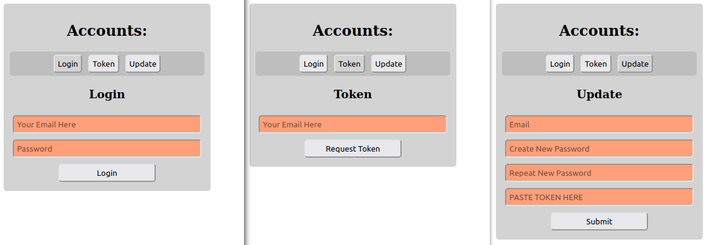
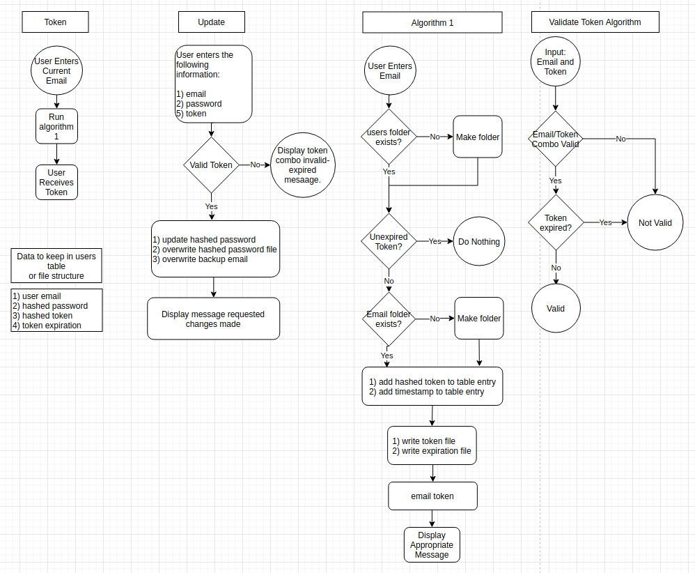

# simpleAccounts
Minimal login access to website with email and password.

- Must change the `action="simpleAccounts.php"` to whatever url address you want.
- Normally I would place the simpleAccounts.html and simpleAccounts.php in the same directory if hosting on a web server.
- If running the program from a local computer, would change the address to the correct server url address, like `action ="https://myDomain.com/myFolder/simpleAccounts.php"` for example.
- If running on a server would recommend changing permission of the simpleAccounts.php to 640.
- the sendToken function uses permissions 0770, but if using on a local secure computer, may need to change to 0777 or otherwise adjust permissions.

## Notes:
- I put the style and scripts right in the main file, in case you are making a single page application and "switching out mains" on the page.
- It does not use MariaDB or MySQL, rather it simply makes a folder named with the email address of the user.

As the project currently stands:
- The user's email serves as the user's primary unique identifier.
- Once the token is used it is destroyed.
- The token is good for 10 minutes.
- Another will not be sent until 10 minutes is up, even it the token has been used.
- The token must be present, valid and unexpired to make changes to the profile.

Inside the users email folder, the following files may be present:
1) Hashed Password (uses standard PHP 7 PASSWORD_DEFAULT mechanism)
2) Hashed Token
3) Token Creation Time

## Here is flow diagram:

